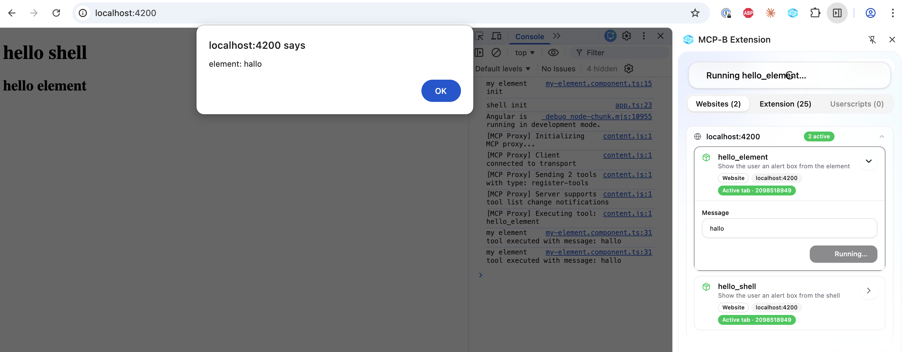

# WebMcpExperiments

This application consists of two angular projects:

- The **element** is a web component
- The **shell** is the main application and hosts the element.

Both applications register a WebMCP tool (using the [@mcp-b/global](https://docs.mcp-b.ai/introduction) polyfill) to show an alert.

Next I start the MCP-B Extension in Chrome and invoke one of the two MCP tools. It is actually invoked two times. 😳



I can skip initialization in the element by commenting out the import:

```typescript
import '@mcp-b/global'; //initializing this again leads to every tool invocation happening twice.
```

No MCP-B is only initialized in the shell and every tool is only invoked once.
